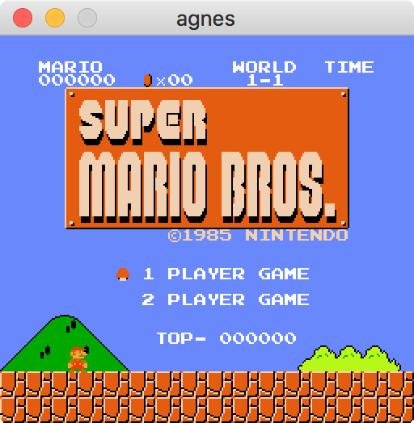
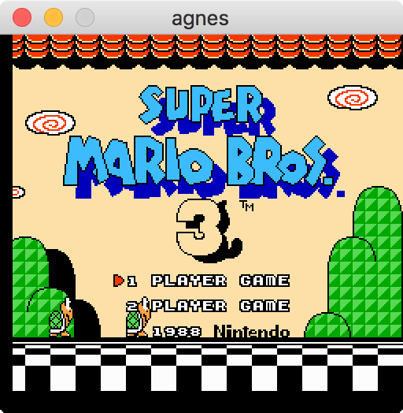
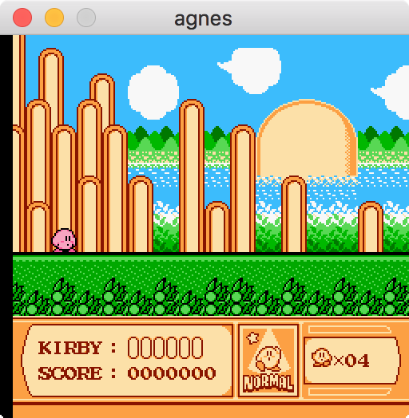
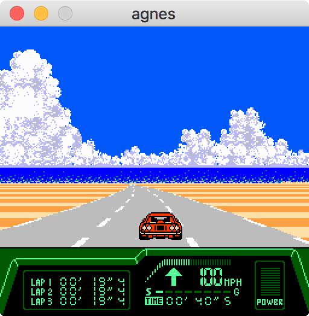
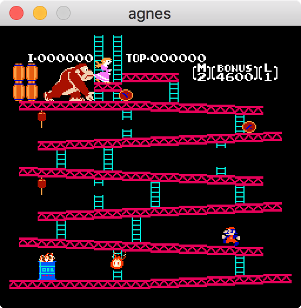

## About
agnes is a header-only NES emulation library with an easy to use API.

## Features
* Header-only (just copy agnes.h).
* Easy to use.
* MIT licensed.
* Supports NROM, UxROM, MMC1 and MMC3 mappers.

## API example
```c
agnes_t *agnes = agnes_make();
agnes_load_ines_data(agnes, game_data, game_data_size);
while (true) {
    agnes_input_t input;
    get_input(&input);

    agnes_set_input(agnes, &input, NULL);

    agnes_next_frame(agnes);

    for (int y = 0; y < AGNES_SCREEN_HEIGHT; y++) {
        for (int x = 0; x < AGNES_SCREEN_WIDTH; x++) {
            agnes_color_t c = agnes_get_screen_pixel(agnes, x, y);
            display_pixel(x, y, c);
        }
    }
}
agnes_destroy(agnes);
```

Full and working examples can be found in [examples directory](http://github.com/kgabis/agnes/tree/master/examples).

## Screenshots
<p float="left">
    
    
    
     
     
     
</p>

## Installation
Run:
```
git clone https://github.com/kgabis/agnes.git
```
and copy agnes.h to you source code tree.

It behaves like most single header libraries - you have to declare AGNES_IMPLEMENTATION in *one* C or C++ file *before* including it.

```c
#define AGNES_IMPLEMENTATION
#include "agnes.h"
```

## Testing
Run ```run_tests.sh ROM_DIRECTORY``` (in tests directory) to compile and run tests.

Since I cannot add roms to this project they must be downloaded manually. Please look at contents of [examples/recs.tar.gz](http://github.com/kgabis/agnes/tree/master/examples/recs.tar.gz) for names of roms that are required to run tests. Emulator testing roms (such as nestest.nes or official_only.nes) can be obtained from [here](https://wiki.nesdev.com/w/index.php/Emulator_tests). If you want to update add a recording or update an existing one run ```recorder``` (located in tests dir).

## TODO
* APU emulation.
* Optimizantions.
* More mappers.
* Being able to access CPU and PPU state using API.

## Splitting and joining
agnes.h can be split into separate files by running ```utils/split.py```:
```bash
utils/split.py --input agnes.h --output-path src
```

It can be joined back into a single file with ```utils/join.py```:
```bash
utils/join.py --template utils/agnes.h.templ --path src --output agnes.h --VERSION 0.1.0
```

## Contributing
I will always merge *working* bug fixes. However, if you want to add something new to the API, please create an "issue" on github for this first so we can discuss if it should end up in the library before you start implementing it.  

## Acknowledgements
*[NesDev Wiki](http://wiki.nesdev.com/w/index.php/Nesdev_Wiki)*

Other open-source NES emulators, that were extremely helpful as a reference:
* https://github.com/fogleman/nes
* https://github.com/AndreaOrru/LaiNES
* https://github.com/ulfalizer/nesalizer/blob/master/src/ppu.cpp
* https://github.com/daniel5151/ANESE

Also, many thanks to [Mateusz Belicki](https://github.com/mbelicki/) for all his suggestions and help.  

## License
[The MIT License (MIT)](http://opensource.org/licenses/mit-license.php)
